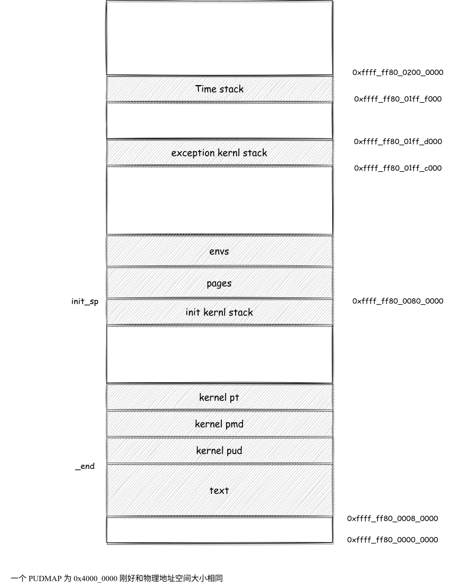

## 提交规则

如果需要做出修改，请另外开出一个分支进行，不要在 `master` 分支上进行修改，分支的命名方式如下

```bash
修改人名称缩写-修改内容
```

比如说强生修改了暴露内核的部分，则分支名应该为

```bash
qs-修改了暴露内核
```

最后的合并到 `master` 的工作由强生完成。

 ## 通用寄存器

一共有 `X0 ~ X30` 31 个通用寄存器。更加详细的内容可以见这个网站 https://www.csdn.net/tags/MtTaggysMTg4NzQtYmxvZwO0O0OO0O0O.html

### 与函数相关

`X0 - X7` 对应 8 个参数，同时 `X0` 还对应返回值。

### 恢复现场

我们约定 `X16, X17` 是恢复现场专用的寄存器，其地位类似于 `MIPS` 中的 `k0, k1` 。其原理似乎是编译器不会使用这两个寄存器。

### 返回地址

`x30` 是专用的返回地址寄存器，所有其又被称为 `ldr` ，其地位相似与 `MIPS` 中的 `ra`。

### 调用者保存和被调用者保存

`X9 ~ X15` 是调用者保存寄存器，所以需要调用者进行保存和恢复，类似于 `MIPS` 中的 `t` 寄存器。

`X19 ~ X29` 是被调用者保存寄存器，所以需要被调用者进行保存和恢复，类似于 `MIPS` 中的 `s` 寄存器。

## 特殊寄存器

### SCR

异常等级为 3 的时候的配置寄存器，具体的参数如下

```c
// 这位与安全内存有关，但是我不知道啥意思
#define SCR_NS              1
// 这位置 1 说明是 Arch64 而置 0 说明是 Arch32
#define SCR_RW              (1 << 10)
```

更加详细的可以参照白书的 P144 页。

### HCR

异常等级为 2 的时候的配置寄存器，具体参数如下

```c
#define HCR_RW              (1 << 31)
// SWIO hardwired on Pi3, 我不知达到哦啥意思
#define HCR_SWIO            (1 << 1)
```

更加详细的可以参照白书的 P144 页。

### SPSR

**Saved Process Status Register**。armv8 应该会维护一个状态寄存器 PSTATE ，当发生异常的时候，会把状态寄存器的值存储到 SPSR 当中。当异常返回的时候，会把 SPSR 的值拷贝到 PSTATE 中。我个人感觉已经可以把二者划等号了。

具体参数如下

```c
// 对应 [9:6] DAIF 意思是关闭中断
#define SPSR_MASK_ALL       (15 << 6)
// 对应 [3:0] 设置异常返回哪一个等级，我不知道具体的对应规则
#define SPSR_EL2H           (9 << 0)
#define SPSR_EL1H           (5 << 0)
```

另外可以分开访问，比如说 `daifset` 指的就是 SPSR 的 `[9:6]` 位。

### SCTLR

系统控制寄存器，指导书给出了完整配置。

### TCR

**Translation Control Register** 翻译控制寄存器，用于控制 TLB 的行为。具体的配置如下

```c
#define TCR_IGNORE1         (1 << 38)
#define TCR_IGNORE0         (1 << 37)
// 内部共享 TTBR1_EL1
#define TCR_ISH1            (3 << 28)
// 内部共享 TTBR0_EL1
#define TCR_ISH0            (3 << 12)
// TTBR1_EL1 外写通达可缓存
#define TCR_OWT             (2 << 26)
// TTBR1_EL1 内写通达可缓存
#define TCR_IWT             (2 << 24)
// 25 位掩码
#define TCR_T0SZ            (25)
#define TCR_T1SZ            (25 << 16)
// TG2 的页面是 4K
#define TCR_TG0_4K          (0 << 14)
// TG1 的页面是 4K
#define TCR_TG1_4K          (0 << 30)
```

### TTBR

一级页表的起始地址存储在这里。

### FAR

far 寄存器里存的就是 BADDR。

### ESR 

esr 寄存器就是同步异常的错误原因，类似与 MOS 中的 Cause。可以在 P150 查到

## MMIO

具体的文档可见该网址：https://www.raspberrypi.org/documentation/hardware/raspberrypi/bcm2836/QA7_rev3.4.pdf 

## 内存地址布局


